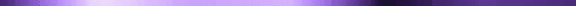

<!-- My Readme Profile!
I spent a lot of time to make my Readme, and if you like it feel free to take inspiration!

**Acknowledgements**
Awesome Readme Templates
Awesome README
How to write a Good readme

**Authors**
@HyunCafe
 -->

 

    

  

<h2 align="center"> Self-taught, curious, and passionate about coding!</h2>

* 🌳 I’m currently learning Typescript!   

* 🌊 2023 Goals: 
   - Develop more projects
   - Contribute to Open Source projects   

* :octocat: Interest: Typescript, Game Dev, and Coffee.   

* ☕ Hobbies: Anime, Reddit.   

  <h2> <strong> Actively Learning </strong></h2>
     
  <h2> <strong> Already Learned </strong></h2>
  

  

    

 

  <h3 align="center">Connect With Me</h3>

   
  
  

 
